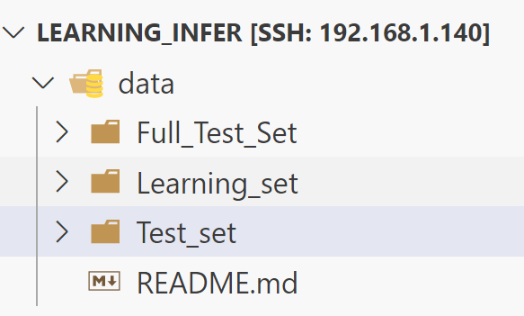

# learning_infer
this is training / inference server of RUL estimate repo
# 해당 프로젝트 내용 추가 

코랩 혹은 로컬 환경에서 돌릴 수 있도록 설정한 모델 관련 코드 
weight는 서버 쪽에서도 사용하는 가중치 코드를 
model은 로컬(코랩) 환경에서 모델 작성하고 러닝 셋을 학습하기 위한 코드들 
data는 PHM2012(FEMTO) 데이터를 사용 (용량이 크므로 따로 받을 것)
server는 이를 웹 서버로 실행하고 파일 in out 을 진행하기 위한 코드들 

https://i4624.tk/sharing/tbUNwOayc 
여기서 다운 

## 서버쪽 코드 구조 

server
├── cnn_lstm_server.py
├── out
└── uploads
    └── file1.txt
    └── file2.jpg
    └── ...
└── results
    └── result1.txt
    └── result2.jpg
    └── ...

## model 코드 구조 

모델 관련 코드 (데이터처리랑, 학습 등으로 폴더 분리예정) 
가중치 출력 코드 
이렇게 나눌 예정 

## Bearing1_1, Bearing1_2에 대한 모델 가중치 설명
하이퍼파라미터 값 수정(Dropout, learning rate, L2 regularization) 미세조정 하였지만 loss 값이 크게 변하지 않음
기존에 사용하였던 하이퍼파라미터 값 그대로 사용해도 되겠다고 판단함
